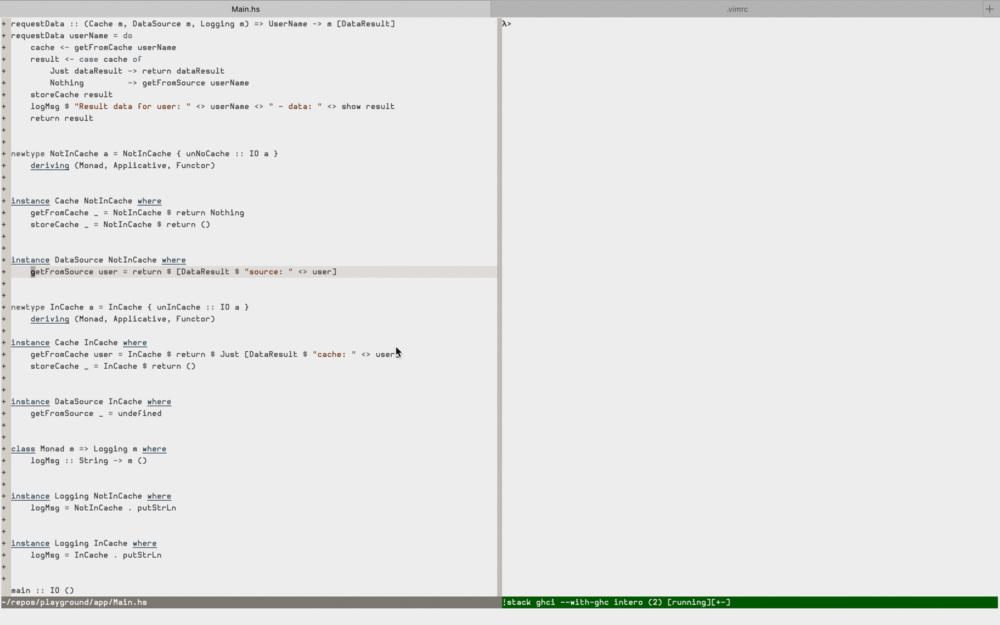
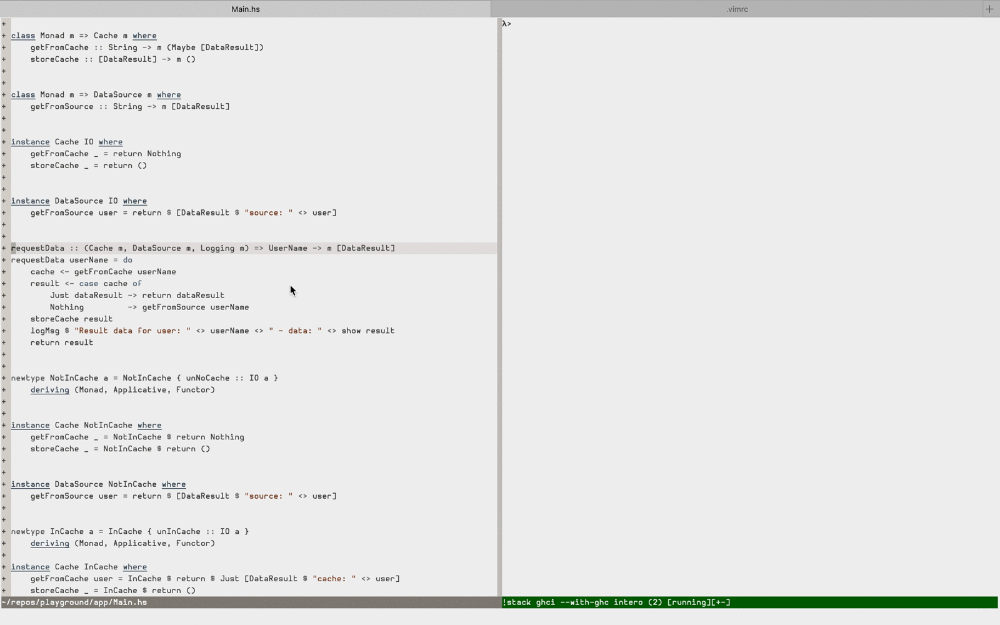
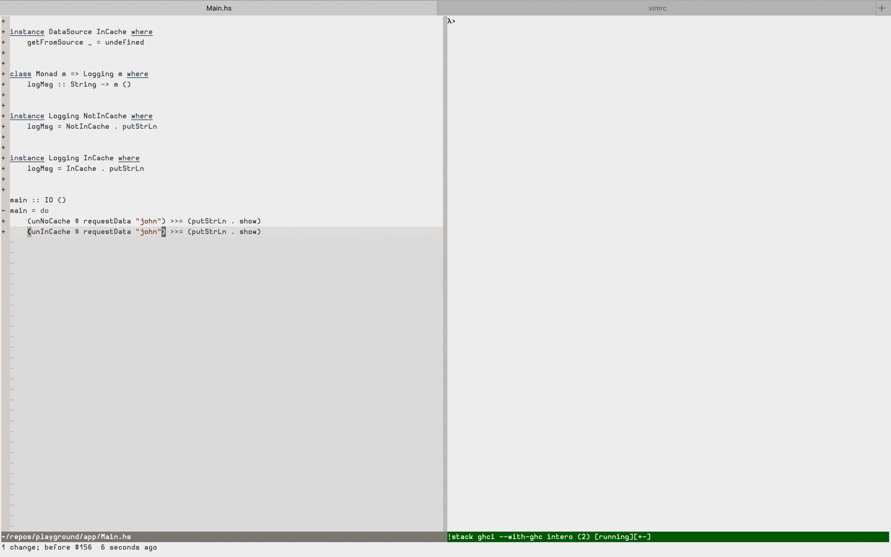

A simple [Intero](https://github.com/chrisdone/intero) integration for Vim.

# Usage

1) `cd ~/.vim/pack/bundle/start/`

2) `git clone https://github.com/adaszko/intero.vim.git`

3) Add to your `.vimrc`:

```VimL
augroup my_haskell
    autocmd!

    autocmd FileType haskell nmap <silent> <buffer> <LocalLeader>I :call intero#toggle()<CR>
    autocmd FileType haskell nmap <silent> <buffer> <LocalLeader>B :call intero#stack_build_toggle()<CR>

    autocmd FileType haskell noremap <silent> <buffer> gd :call intero#go_to_definition()<CR>
    autocmd FileType haskell setlocal omnifunc=intero#omnicomplete

    autocmd FileType haskell xnoremap <silent> <buffer> <LocalLeader>t :call intero#type_of_selection()<CR>
    autocmd FileType haskell nnoremap <silent> <buffer> <LocalLeader>t :call intero#type_at_cursor()<CR>
    autocmd FileType haskell nnoremap <silent> <buffer> <LocalLeader>i :call intero#send_line(printf(":info %s", expand("<cword>")))<CR>
    autocmd FileType haskell nnoremap <silent> <buffer> <LocalLeader>k :call intero#send_line(printf(":kind %s", expand("<cword>")))<CR>
    autocmd FileType haskell nnoremap <silent> <buffer> <LocalLeader>r :call intero#send_line(":reload")<CR>
    autocmd FileType haskell xnoremap <silent> <buffer> <LocalLeader>s :call intero#send_selection()<CR>

    " Populates the quickfix list.  Use :copen to see the results
    autocmd FileType haskell nnoremap <silent> <buffer> <LocalLeader>R :call intero#uses_at_cursor()<CR>

    autocmd FileType haskell nnoremap <silent> <buffer> <LocalLeader>l :call intero#send_line(printf(":load %s", expand("%")))<CR>
augroup END
```

4) Build Intero within your stack project: `stack build intero`
5) Open your project file and use `\I` to start the Intero shell (adjust for
   your `<LocalLeader>` setting)


# (Not exhaustive) demo

 * `:reload`, `:kind`, `:type`, go-to-definition



 * `:type-at` (get type of an expression)



 * `'omnifunc'` (Vim's `<C-X><C-O>` completion)



